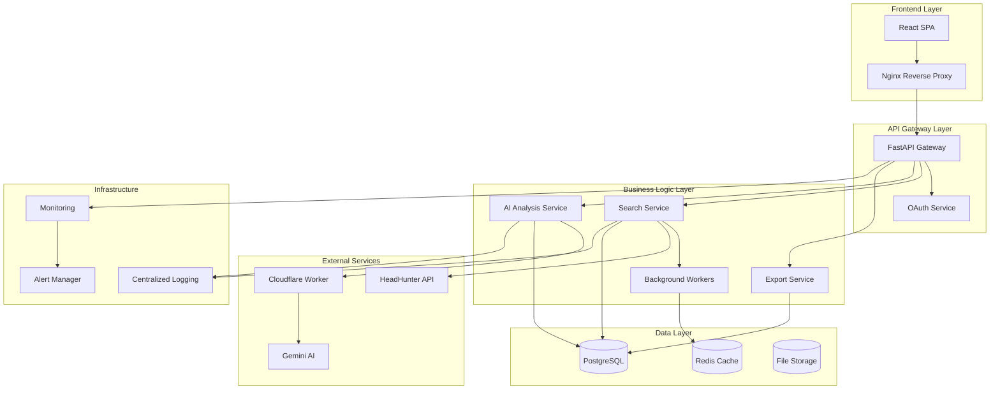

# Дизайн системы анализа резюме HH с ИИ

## Обзор

Система HH Resume Analyzer представляет собой микросервисную архитектуру, построенную на современных технологиях с акцентом на производительность, масштабируемость и надежность. Система интегрируется с HeadHunter API для получения резюме и использует Gemini AI через Cloudflare Worker для интеллектуального анализа кандидатов.

## Архитектура

### Высокоуровневая архитектура



### Компонентная архитектура

#### Frontend (React SPA)
- **Технологии**: React 18, Material-UI, React Router, Axios
- **Состояние**: Context API + useReducer для глобального состояния
- **Компоненты**:
  - SearchForm: Форма поиска с валидацией
  - ResultsList: Отображение результатов с фильтрами
  - CandidateCard: Карточка кандидата с деталями
  - ProgressTracker: Индикатор прогресса обработки
  - ExportButton: Кнопка экспорта результатов

#### API Gateway (FastAPI)
- **Роль**: Единая точка входа для всех API запросов
- **Функции**:
  - Аутентификация и авторизация
  - Rate limiting
  - Валидация запросов
  - Маршрутизация к микросервисам
  - Логирование и мониторинг

#### Search Service
- **Ответственность**: Управление поисковыми запросами
- **Функции**:
  - Интеграция с HeadHunter API
  - Управление жизненным циклом поиска
  - Предварительная фильтрация и скоринг
  - Координация с AI Service

#### AI Analysis Service
- **Ответственность**: ИИ-анализ резюме
- **Функции**:
  - Извлечение концепций из запросов
  - Глубокий анализ резюме
  - Детекция ИИ-сгенерированных резюме
  - Кеширование результатов анализа

#### Background Workers (Celery)
- **Ответственность**: Асинхронная обработка задач
- **Задачи**:
  - Поиск резюме в HeadHunter
  - ИИ-анализ кандидатов
  - Генерация экспортных файлов
  - Очистка устаревших данных

## Компоненты и интерфейсы

### API Endpoints

#### Search API
```python
POST /api/v1/search
{
    "city": "Москва",
    "query": "Менеджер по продажам B2B",
    "max_resumes": 200
}
Response: {"search_id": "uuid", "status": "pending"}

GET /api/v1/search/{search_id}
Response: {
    "id": "uuid",
    "status": "completed",
    "total_found": 150,
    "analyzed_count": 50,
    "results": [...]
}

GET /api/v1/search/{search_id}/status
Response: {
    "status": "processing",
    "progress": 75,
    "current_step": "ai_analysis"
}
```

#### Resume API
```python
GET /api/v1/resume/{resume_id}
Response: {
    "id": "uuid",
    "name": "Иван Петров",
    "age": 28,
    "title": "Менеджер по продажам",
    "ai_score": 8,
    "ai_summary": "Опытный менеджер...",
    "ai_questions": ["Вопрос 1", "Вопрос 2", "Вопрос 3"]
}
```

#### Export API
```python
GET /api/v1/export/{search_id}/excel
Response: Binary Excel file

GET /api/v1/export/{search_id}/csv
Response: CSV file
```

#### Auth API
```python
GET /api/v1/auth/hh/login
Response: Redirect to HeadHunter OAuth

GET /api/v1/auth/hh/callback?code=...
Response: {"access_token": "jwt_token", "user": {...}}

POST /api/v1/auth/refresh
Response: {"access_token": "new_jwt_token"}
```

### Cloudflare Worker Integration

#### Worker Endpoint Structure
```javascript
// https://proud-water-5293.olegvagin1311.workers.dev/
POST /extract-concepts
{
    "query": "Менеджер по продажам B2B"
}
Response: {
    "concepts": [
        ["менеджер по продажам", "sales manager"],
        ["b2b", "корпоративные продажи"]
    ]
}

POST /analyze-resume
{
    "resume_data": {...},
    "query": "...",
    "concepts": [...]
}
Response: {
    "score": 8,
    "summary": "Краткое резюме кандидата",
    "questions": ["Вопрос 1", "Вопрос 2", "Вопрос 3"],
    "ai_generated": false
}
```

#### Worker Error Handling
- Retry logic с экспоненциальным backoff
- Fallback на mock данные при недоступности
- Circuit breaker pattern для предотвращения каскадных сбоев

### HeadHunter API Integration

#### OAuth 2.0 Flow
1. Пользователь нажимает "Войти через HH"
2. Редирект на `https://hh.ru/oauth/authorize`
3. Получение authorization code
4. Обмен code на access_token
5. Сохранение токена в защищенном хранилище

#### Resume Search Integration
```python
# Поиск резюме
GET https://api.hh.ru/resumes
Headers: Authorization: Bearer {access_token}
Params: {
    "area": "1",  # Москва
    "specialization": "17",  # IT
    "text": "Python разработчик",
    "per_page": 100
}

# Получение детального резюме
GET https://api.hh.ru/resumes/{resume_id}
Headers: Authorization: Bearer {access_token}
```

## Модели данных

### PostgreSQL Schema

```sql
-- Поисковые запросы
CREATE TABLE searches (
    id UUID PRIMARY KEY DEFAULT gen_random_uuid(),
    user_id UUID NOT NULL,
    city VARCHAR(100) NOT NULL,
    query TEXT NOT NULL,
    status VARCHAR(20) DEFAULT 'pending',
    total_found INTEGER DEFAULT 0,
    analyzed_count INTEGER DEFAULT 0,
    created_at TIMESTAMP WITH TIME ZONE DEFAULT NOW(),
    completed_at TIMESTAMP WITH TIME ZONE,
    error_message TEXT,
    settings JSONB DEFAULT '{}'
);

-- Резюме кандидатов
CREATE TABLE resumes (
    id UUID PRIMARY KEY DEFAULT gen_random_uuid(),
    search_id UUID REFERENCES searches(id) ON DELETE CASCADE,
    hh_id VARCHAR(50) UNIQUE NOT NULL,
    name VARCHAR(200),
    age INTEGER,
    city VARCHAR(100),
    title VARCHAR(300),
    salary INTEGER,
    currency VARCHAR(10),
    raw_data JSONB,
    preliminary_score DECIMAL(5,2),
    ai_score INTEGER CHECK (ai_score >= 1 AND ai_score <= 10),
    ai_summary TEXT,
    ai_questions JSONB,
    ai_generated_detected BOOLEAN DEFAULT FALSE,
    analyzed BOOLEAN DEFAULT FALSE,
    created_at TIMESTAMP WITH TIME ZONE DEFAULT NOW(),
    INDEX idx_search_id (search_id),
    INDEX idx_hh_id (hh_id),
    INDEX idx_ai_score (ai_score)
);

-- Извлеченные концепции
CREATE TABLE concepts (
    id UUID PRIMARY KEY DEFAULT gen_random_uuid(),
    search_id UUID REFERENCES searches(id) ON DELETE CASCADE,
    concepts JSONB NOT NULL,
    created_at TIMESTAMP WITH TIME ZONE DEFAULT NOW()
);

-- Пользователи
CREATE TABLE users (
    id UUID PRIMARY KEY DEFAULT gen_random_uuid(),
    hh_user_id VARCHAR(50) UNIQUE NOT NULL,
    email VARCHAR(255),
    name VARCHAR(200),
    access_token TEXT,
    refresh_token TEXT,
    token_expires_at TIMESTAMP WITH TIME ZONE,
    created_at TIMESTAMP WITH TIME ZONE DEFAULT NOW(),
    last_login TIMESTAMP WITH TIME ZONE
);

-- Сессии пользователей
CREATE TABLE user_sessions (
    id UUID PRIMARY KEY DEFAULT gen_random_uuid(),
    user_id UUID REFERENCES users(id) ON DELETE CASCADE,
    session_token VARCHAR(255) UNIQUE NOT NULL,
    expires_at TIMESTAMP WITH TIME ZONE NOT NULL,
    created_at TIMESTAMP WITH TIME ZONE DEFAULT NOW()
);
```

### Redis Cache Structure

```python
# Кеш результатов ИИ-анализа
"ai_analysis:{resume_hash}" = {
    "score": 8,
    "summary": "...",
    "questions": [...],
    "ai_generated": false,
    "expires": 86400  # 24 часа
}

# Кеш концепций запросов
"concepts:{query_hash}" = {
    "concepts": [[...], [...]],
    "expires": 604800  # 7 дней
}

# Статус фоновых задач
"task_status:{search_id}" = {
    "status": "processing",
    "progress": 75,
    "current_step": "ai_analysis",
    "expires": 3600  # 1 час
}

# Rate limiting
"rate_limit:{user_id}:{endpoint}" = {
    "count": 10,
    "expires": 3600  # 1 час
}
```

## Обработка ошибок

### Стратегия обработки ошибок

#### API Gateway Level
- Валидация входящих данных с детальными сообщениями об ошибках
- Стандартизированный формат ошибок (RFC 7807)
- Логирование всех ошибок с correlation ID

#### Service Level
- Circuit breaker для внешних сервисов
- Retry logic с экспоненциальным backoff
- Graceful degradation при недоступности ИИ

#### Database Level
- Connection pooling с автоматическим восстановлением
- Транзакционная целостность данных
- Backup и recovery процедуры

### Коды ошибок

```python
# Стандартные HTTP коды
200 - OK
201 - Created
400 - Bad Request (валидация)
401 - Unauthorized
403 - Forbidden
404 - Not Found
429 - Too Many Requests
500 - Internal Server Error
502 - Bad Gateway (внешний сервис недоступен)
503 - Service Unavailable

# Кастомные коды ошибок
HH_API_UNAVAILABLE = "HH_001"
AI_SERVICE_UNAVAILABLE = "AI_001"
SEARCH_LIMIT_EXCEEDED = "LIMIT_001"
INVALID_SEARCH_QUERY = "QUERY_001"
```

## Стратегия тестирования

### Unit Tests (80% покрытие)
- Тестирование бизнес-логики сервисов
- Мокирование внешних зависимостей
- Тестирование валидации данных

### Integration Tests
- Тестирование API endpoints
- Тестирование интеграции с базой данных
- Тестирование Cloudflare Worker интеграции

### End-to-End Tests
- Полный цикл поиска и анализа резюме
- Тестирование пользовательских сценариев
- Тестирование экспорта данных

### Performance Tests
- Load testing для API endpoints
- Stress testing для фоновых задач
- Memory leak detection

### Security Tests
- Penetration testing
- OWASP Top 10 compliance
- Data encryption verification

## Мониторинг и наблюдаемость

### Метрики (Prometheus)
- Количество поисковых запросов
- Время обработки запросов
- Успешность вызовов внешних API
- Использование ресурсов (CPU, память, диск)

### Логирование (ELK Stack)
- Структурированные логи в JSON формате
- Correlation ID для трассировки запросов
- Централизованное хранение логов
- Алерты на критические ошибки

### Трассировка (Jaeger)
- Распределенная трассировка запросов
- Анализ производительности микросервисов
- Выявление узких мест в системе

### Health Checks
```python
GET /health
{
    "status": "healthy",
    "version": "1.0.0",
    "timestamp": "2024-01-15T10:30:00Z",
    "services": {
        "database": "healthy",
        "redis": "healthy",
        "hh_api": "healthy",
        "ai_service": "degraded"
    }
}
```

## Безопасность

### Аутентификация и авторизация
- OAuth 2.0 с HeadHunter
- JWT токены для API доступа
- Refresh token rotation
- Role-based access control (RBAC)

### Защита данных
- Шифрование персональных данных в БД (AES-256)
- HTTPS для всех соединений (TLS 1.3)
- Автоматическое удаление данных через 30 дней
- Соблюдение GDPR требований

### API Security
- Rate limiting (100 запросов/час на пользователя)
- Input validation и sanitization
- CORS настройки
- API key rotation для внешних сервисов

### Infrastructure Security
- Network segmentation
- Firewall rules
- Regular security updates
- Vulnerability scanning

## Производительность и масштабируемость

### Горизонтальное масштабирование
- Stateless API сервисы
- Load balancer (Nginx/HAProxy)
- Auto-scaling на основе метрик
- Database read replicas

### Кеширование
- Redis для кеширования ИИ-результатов
- CDN для статических ресурсов
- Application-level кеширование
- Database query optimization

### Асинхронная обработка
- Celery для фоновых задач
- Message queue (Redis/RabbitMQ)
- Task prioritization
- Dead letter queue для failed tasks

### Оптимизация базы данных
- Индексы для частых запросов
- Партиционирование больших таблиц
- Connection pooling
- Query optimization

## Развертывание и DevOps

### Контейнеризация
- Docker containers для всех сервисов
- Multi-stage builds для оптимизации размера
- Health checks в контейнерах
- Resource limits и requests

### Оркестрация (Kubernetes)
- Deployment manifests
- Service discovery
- ConfigMaps и Secrets
- Horizontal Pod Autoscaler

### CI/CD Pipeline
- Automated testing на каждый commit
- Code quality checks (SonarQube)
- Security scanning
- Blue-green deployment

### Infrastructure as Code
- Terraform для инфраструктуры
- Ansible для конфигурации
- GitOps подход
- Environment parity