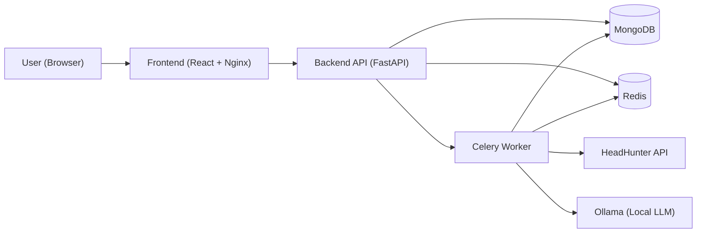
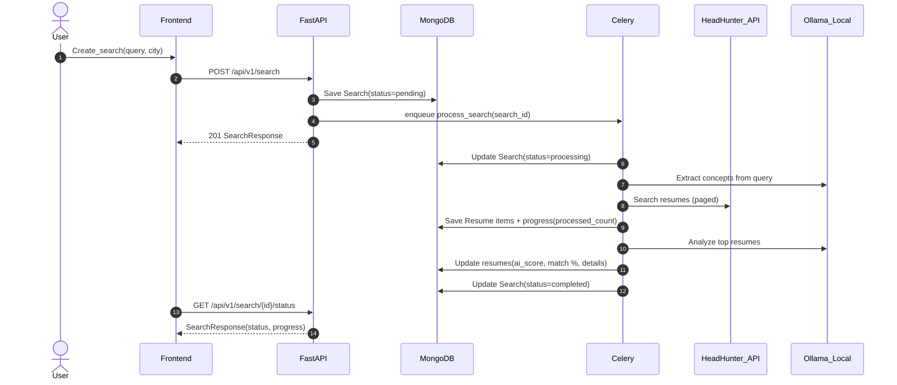
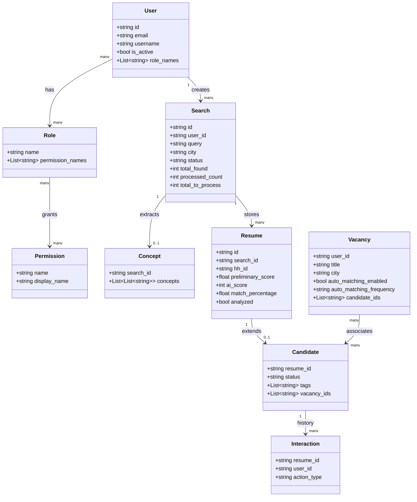

# HH Resume Analyzer

Сервис для поиска резюме на HeadHunter и первичной оценки кандидатов. Проект включает backend API, frontend (веб‑интерфейс) и фоновые задачи (Celery) для длительных операций: парсинг резюме, скоринг, генерация рекомендаций и т.п.

## Что умеет

- **Поиск резюме** по запросу и городу (HeadHunter).
- **Асинхронная обработка** поиска через Celery: прогресс, статусы, ошибки.
- **Скоринг** резюме: предварительный + итоговый (включая match % и детальные поля анализа).
- **ATS‑часть**: вакансии, кандидаты, статусы, теги/папки, сравнение, комментарии, уведомления, аналитика.
- **RBAC**: пользователи/роли/права.
- **Экспорт** результатов.

## Технологии

- **Backend**: FastAPI, Pydantic v2, Beanie (MongoDB), Redis, Celery, JWT.
- **Frontend**: React 18, MUI, React Router, React Query, Vite.

## Быстрый старт (Docker Compose)

1) Создай `.env` из шаблона:

```bash
cp env.production.template .env
```

2) Запусти сервисы:

```bash
docker-compose -f docker-compose.prod.yml up -d --build
```

3) Проверки:
- **Frontend**: `http://localhost:3000`
- **Backend health**: `http://localhost:8000/api/v1/health/live`
- **API docs**: `http://localhost:8000/docs`

Подробная инструкция: `DEPLOYMENT_INSTRUCTIONS.md`.

## Локальный запуск (для разработки)

### Требования
- Python 3.11+
- Node.js 18+
- MongoDB + Redis (или Docker Compose)

### Backend

```bash
cd backend
python -m venv venv
venv\Scripts\activate  # Windows (PowerShell/CMD)
# Linux/macOS:
# source venv/bin/activate
pip install -r requirements.txt
uvicorn app.main:app --reload --port 8000
```

### Celery worker

```bash
cd backend
celery -A celery_app.celery worker --loglevel=info
```

### Frontend

```bash
cd frontend
npm install
npm run dev
```

## Переменные окружения (минимум)

Фактические значения и полный список — в `env.production.template`.

- `MONGODB_URL` (например `mongodb://mongodb:27017` в Docker)
- `MONGODB_DATABASE` (по умолчанию `hh_analyzer`)
- `REDIS_URL` (например `redis://redis:6379` в Docker)
- `SECRET_KEY` (обязательно заменить для production)
- `CORS_ORIGINS` (например `http://localhost:3000,http://localhost`)
- `OLLAMA_URL` (по умолчанию `http://localhost:11434`)
- `OLLAMA_MODEL` (например `mistral`, `llama3`, `qwen2.5`)

## Архитектура (UML/диаграммы)

### Компоненты (Component)



### Флоу “Создать поиск резюме” (Sequence)



### Упрощённая доменная модель (Class)



## API (крупные группы эндпоинтов)

Backend монтируется с префиксом `/api/v1` и включает роуты:
- `/auth` (register/login/refresh/me/logout)
- `/users`
- `/search` (создание поиска, статусы, резюме, фильтры)
- `/export`
- `/candidates`
- `/vacancy`
- `/comments`
- `/comparison`
- `/notifications`
- `/analytics`
- `/bulk-actions`

## Структура проекта

```
HH_AI/
├── backend/     # FastAPI + Celery + доменная модель
├── frontend/    # React SPA
├── monitoring/  # Prometheus/Grafana/Loki configs
├── scripts/     # обслуживающие скрипты (backup, firewall, ngrok и т.д.)
└── docker-compose.prod.yml
```
